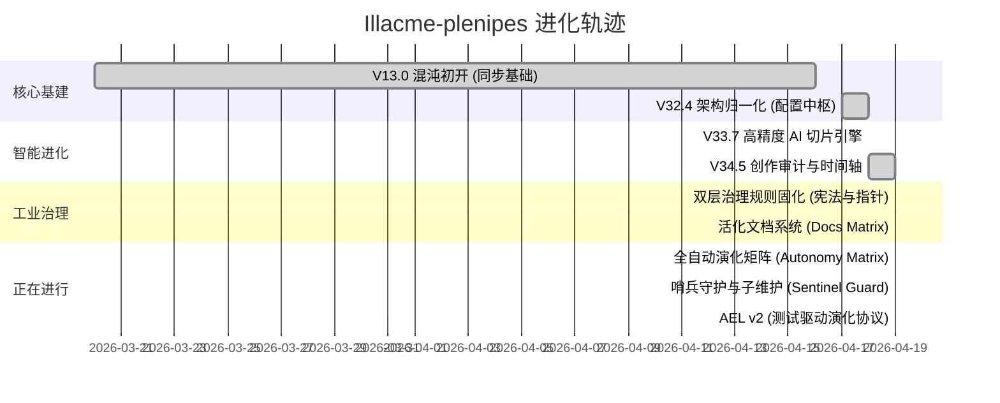

# 🗺️ Illacme-plenipes 进化路线图 (Evolution Roadmap)

> [!NOTE]
> 最后更新日期: 2026-04-23 (AEL-Iter-v4.5)

本文件由 Antigravity 自动维护，实时跟踪项目的里程碑与工程生命周期。

## 📊 发展里程碑 (Milestones)

## 🎯 当前主要任务 (Active Initiatives)

### 1. [进行中] SSG 全路径兼容性增强 (GGP)
- **目标**：实现对 Hugo, Hexo, Nextra 等框架的 100% 物理支持。
- **状态**：v4.5 栈式重构已完成 ✅
- **迭代记录**：[.plenipes/history/2026-04-23_callout_refactor/](./.plenipes/history/2026-04-23_callout_refactor/)

### 2. [NEW] 主权地平线 (Project Sovereignty)
- **目标**：逻辑服务化重构，建立 AST 动态契约与自愈闭环。
- **状态**：v5.0 Phase 1 启动 🏗️
- **进度**：
    - [x] v4.5: 呼叫适配器归一化与栈式解析
    - [x] v5.0: 逻辑服务化重构 (Logical Sovereignty) [Phase 1]
    - [/] v5.1: 自进化哨兵闭环 (Sentinel Closure) [Phase 2]
    - [ ] v5.2: 影子仿真增量化与自愈逻辑

---

## 📅 历史迭代记录 (Historical Iterations)

- [x] **2026-04-18**: [创作审计时间轴构建 (Timeline Implementation)](./.plenipes/history/2026-04-18_audit_timeline/)
- [x] **2026-04-19**: [双层治理固化 (Governance Solidification)](./.plenipes/history/2026-04-19_governance/)
- [x] **2026-04-19**: [活化文档系统矩阵 (Docs Matrix)](./.plenipes/history/2026-04-19_docs_matrix/)
