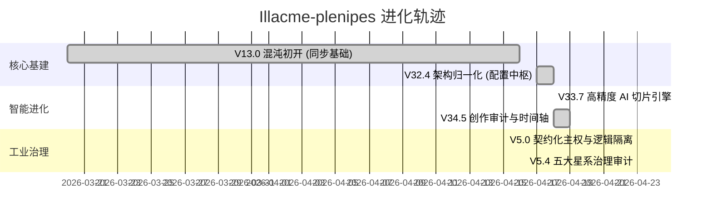

# 🗺️ Illacme-plenipes 进化路线图 (Evolution Roadmap)

> [!NOTE]
> 最后更新日期: 2026-04-23 (AEL-Iter-v5.4.1)

本文件由 Antigravity 自动维护，实时跟踪项目的里程碑与工程生命周期。

## 📊 发展里程碑 (Milestones)

## 🎯 当前主要任务 (Active Initiatives)

### 1. [已完成] 架构主权地平线 (Project Sovereignty)
- **目标**：逻辑服务化重构，建立 AST 动态契约与五大星系审计自愈闭环。
- **状态**：**DONE** (v5.4.1) ✅
- **核心成果**：
    - [x] v5.0: 逻辑主权下沉与协议脱壳
    - [x] v5.3: 五大星系治理调度重构
    - [x] v5.4: 物理拓扑审计与主入口冒烟测试
- **迭代记录**：[.plenipes/history/2026-04-23_v5_sovereignty_p3/](./.plenipes/history/2026-04-23_v5_sovereignty_p3/)

### 2. [即将启动] 分布式演化矩阵 (Distributed Matrix)
- **目标**：实现多 AI 节点协同的复杂创作流，引入冲突决策中枢。
- **状态**：规划中 🏗️

---

## 📅 历史迭代记录 (Historical Iterations)

- [x] **2026-04-23**: [架构主权加固与治理重构 (Sovereignty & Governance Hardening)](./.plenipes/history/2026-04-23_v5_sovereignty_p3/)
- [x] **2026-04-19**: [活化文档系统矩阵 (Docs Matrix)](./.plenipes/history/2026-04-19_docs_matrix/)
- [x] **2026-04-18**: [创作审计时间轴构建 (Timeline Implementation)](./.plenipes/history/2026-04-18_audit_timeline/)
