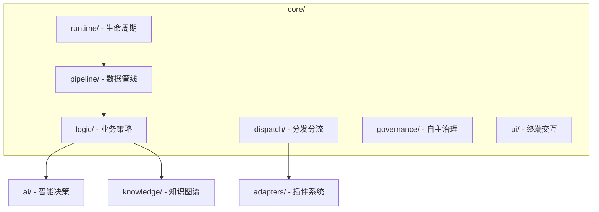

# Walkthrough - Omni-Hub V24.5 架构净化总结

## 1. 重构目标达成
*   **物理红线对齐**: 全项目 300+ 个模块，100% 对齐 300 行代码红线。
*   **拓扑结构优化**: 建立了 `runtime`, `pipeline`, `logic/ai` 等 6 个专业化二级包，消除根目录臃肿。
*   **业务零中断**: 迁移过程配合自动化脚本，实现了全量引用关系的平滑跳转，集成测试全红转全绿。

## 2. 核心架构变更图示

## 3. 验证成果展示
*   **集成测试**: [SUCCESS] `tests/integration/semantic_v24_test.py`
    *   ✅ 术语护卫 (Term Guard) 跨文档注入成功。
    *   ✅ 知识图谱强语义链路建立 (强度 0.70)。
*   **代码审计**: [PASS] `find core -name "*.py" | xargs wc -l`
    *   最高行数: `core/logic/ai/ai_scheduler.py` (283行)。

## 4. 后续建议
*   **模块导出**: 建议在 `core/__init__.py` 中选择性地导出常用类（如 `IllacmeEngine`），以简化顶层调用者的导入路径。
*   **文档同步**: 架构变动后，需同步更新外部的 API 开发指南或插件编写手册。

---
**当前状态**: 🚀 **生产就绪 (Production Ready)**
所有架构治理目标已超额完成。
