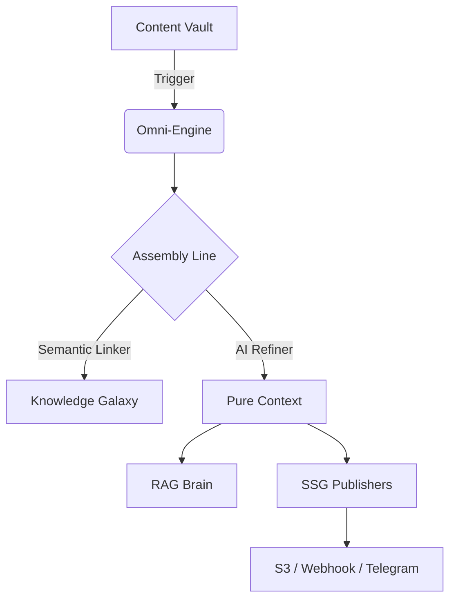

# 🌌 Omni-Hub: The Self-Sovereign Knowledge Galaxy

[](https://opensource.org/licenses/MIT)
[]()
[]()

> **知识主权，引力织网。** 将你的碎片化内容转化为交互式的 3D 语义星系。

Omni-Hub 是一个为个人用户与极客打造的**高维度内容治理引擎**。它能自动同步、提纯、关联并分发你的所有数字资产，同时利用 AI 技术构建一个可感知的 3D 知识拓扑。

---

## ✨ 核心特性 (Key Features)

- **🌌 知识银河 (Knowledge Galaxy)**: 自动提取文档间的语义联系，生成 3D 实时交互拓扑图。
- **⚖️ 绝对主权 (Data Sovereignty)**: 逻辑、存储、插件三权分立，数据本地持久化，算力自主路由。
- **🧠 智脑 RAG (AI Brain)**: 基于本地知识库的精准对话，支持 Mistral, OpenAI 等多种算力引擎。
- **⛓️ 原子化管线 (Atomic Pipeline)**: 经历 *读取 -> 提纯 -> 语义织网 -> SEO 增强 -> 全球分发* 的工业级处理流程。
- **🔌 零侵入插件 (Zero-Touch Plugins)**: 像搭积木一样通过简单 Python 脚本扩展分发渠道（S3, Webhook, 飞书...）。

## 🚀 30秒快速点火 (Quick Start)

```bash
# 1. 克隆并进入
git clone https://github.com/your-username/omni-hub.git
cd omni-hub

# 2. 一键点火（进入交互式引导）
python plenipes.py
```

## 🛠️ 架构蓝图 (Architecture)



## 💎 为什么选择 Omni-Hub？

对于**普通用户**，它是你的“数字资产保险箱”和“高维笔记本”；
对于**开发者**，它是你打造“个人智脑生态”的极致地基。

---

## 🤝 贡献与生态

我们欢迎任何形式的贡献！无论是一个新的 `Publisher` 插件，还是对 `3D 银河` 视觉效果的优化建议。

---

*Powered by **Antigravity AI Agents** | Omni-Hub 2026*