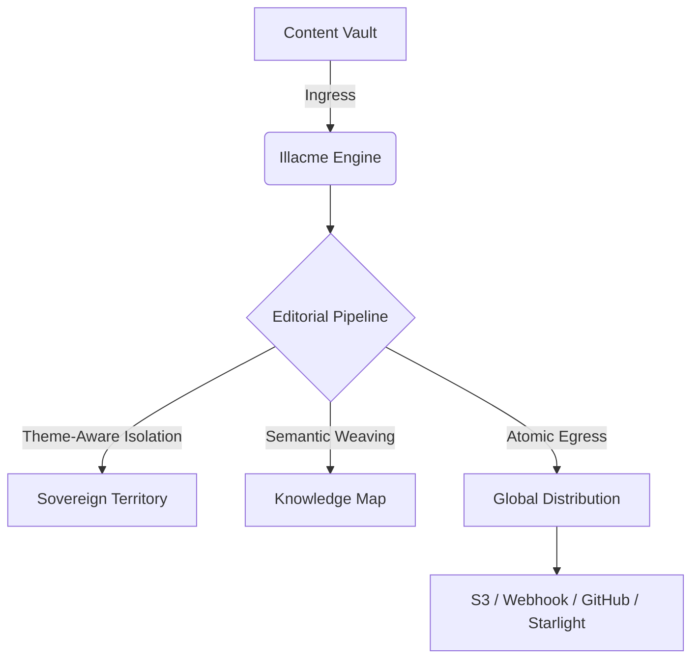

# 🏛️ Illacme Plenipes: 全球私人出版社 (Global Private Press)
## 您的主权化全球出版发行中心 (Sovereign Global Publishing & Distribution Center)

[](https://opensource.org/licenses/MIT)
[]()
[]()

> **主权至上，全球出版**：基于物理隔离架构的工业级个人出版操作系统。

Illacme Plenipes 是一款为高端创作者、机构及极客打造的**高维度主权内容治理引擎**。它遵循“主权隔离架构 (Sovereign Architecture)”，旨在为您提供数据、算力与出版权的绝对尊严，将您的数字资产转化为全球化的品牌力量。

---

## ✨ 核心特性 (Key Features)

-   **🏛️ 全球私人出版社 (Global Private Press)**: [V35.2] 完整的出版生命周期管理，支持 AI 驱动的多语种转化与 SEO 增强。
-   **⚖️ 主权化分发中心 (Sovereign Distribution)**: 绝对物理隔离的疆域 (Territory) 协议，确保账本、索引与脉搏数据的主权独立。
-   **🌌 语义织网 (Semantic Weaving)**: 自动提取文档间的语义联系，生成实时交互的知识图谱。
-   **🧠 主权智脑 (Sovereign AI)**: 基于私有疆域知识库的精准对话，支持 100% 本地化算力路由。
-   **⛓️ 原子化管线 (Atomic Pipeline)**: 经历 *读取 -> 提纯 -> 语义织网 -> SEO 增强 -> 全球分发* 的工业级处理流程。

## 🚀 快速点火 (Quick Start)

```bash
# 1. 克隆并进入
git clone https://github.com/your-username/illacme-plenipes.git
cd illacme-plenipes

# 2. 一键点火（进入交互式主权引导）
python plenipes.py
```

## 🛠️ 架构蓝图 (Sovereign Architecture)



---

## 🤝 贡献与生态
我们欢迎任何致力于提升个人出版主权的贡献！无论是一个新的 `Publisher` 插件，还是对 `Sovereign_OS` 架构的优化建议。

---
*Powered by **Antigravity AI Agents** | Illacme Plenipes 2026*