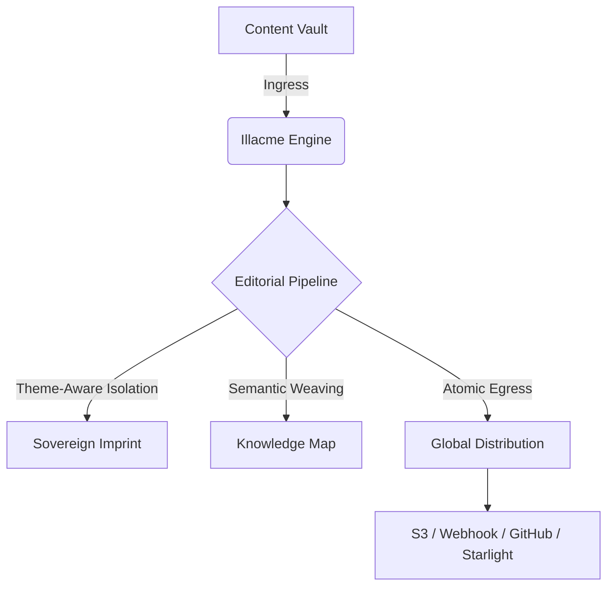

# 🏛️ Illacme Plenipes: 全球私人出版社 (Global Private Press)
## 您的主权化全球出版发行中心 (Sovereign Global Publishing & Distribution Center)

[](https://creativecommons.org/licenses/by-nc/4.0/)
[]()
[]()

> **主权至上，全球出版**：基于物理隔离架构的工业级个人出版操作系统。

Illacme Plenipes 是一款为高端创作者、机构及极客打造的**高维度主权内容治理引擎**。它遵循“主权隔离架构 (Sovereign Architecture)”，旨在为您提供数据、算力与出版权的绝对尊严，将您的数字资产转化为全球化的品牌力量。

---

## ✨ 核心特性 (Key Features)

-   **🏛️ 全球私人出版社 (Global Private Press)**: [V50.3] 完整的出版生命周期管理，支持 AI 驱动的多语种转化与 SEO 增强。
-   **⚖️ 主权化分发中心 (Sovereign Distribution)**: 绝对物理隔离的出版品牌 (Imprint) 协议，确保账本、索引与脉搏数据的主权独立。
-   **🌌 语义织网 (Semantic Weaving)**: 自动提取文档间的语义联系，生成实时交互的知识图谱。
-   **🧠 主权智脑 (Sovereign AI)**: 基于私有 Imprint 知识库的精准对话，支持 100% 本地化算力路由。
-   **⛓️ 原子化管线 (Atomic Pipeline)**: 经历 *读取 -> 提纯 -> 语义织网 -> SEO 增强 -> 全球分发* 的工业级处理流程。

## 🚀 快速点火 (Quick Start)

```bash
# 1. 克隆并进入
git clone https://github.com/your-username/illacme-plenipes.git
cd illacme-plenipes

# 2. 一键点火（进入交互式主权引导）
python plenipes.py
```

## 🛠️ 架构蓝图 (Sovereign Architecture)


```mermaid
graph TD
    A[Content Vault] -->|Ingress| B(Illacme Engine)
    B --> C{Editorial Pipeline}
    C -->|Theme-Aware Isolation| D[Sovereign Imprint]
    C -->|Semantic Weaving| E[Knowledge Map]
    C -->|Atomic Egress| F[Global Distribution]
    F --> G[S3 / Webhook / GitHub / Starlight]
```

---

## 📜 治理协议与商业许可 (Governance & Commercial Licensing)

- **开源非商业许可**：开源版本采用 [CC BY-NC 4.0](https://creativecommons.org/licenses/by-nc/4.0/) 协议，仅供个人学习与非商业研究。
- **商业授权 (Commercial EULA)**：企业或商业化部署请参阅 [商业最终用户许可协议 (EULA)](file:///Volumes/Notebook/omni-hub/illacme-plenipes/docs/legal/EULA.md)。
- **数据主权承诺**：请参阅 [数据主权与内容所有权协议](file:///Volumes/Notebook/omni-hub/illacme-plenipes/docs/legal/DATA_SOVEREIGNTY.md)。
- **免责与第三方声明**：请参阅 [第三方凭据免责声明](file:///Volumes/Notebook/omni-hub/illacme-plenipes/docs/legal/THIRD_PARTY_DISCLAIMER.md) 与 [第三方开源致谢](file:///Volumes/Notebook/omni-hub/illacme-plenipes/docs/legal/THIRD_PARTY_NOTICES.md)。

---

## 🤝 贡献与生态
我们欢迎任何致力于提升个人出版主权的贡献！无论是一个新的 `Publisher` 插件，还是对 `Sovereign_OS` 架构的优化建议。

---
*Powered by **Antigravity AI Agents** | Illacme Plenipes 2026*