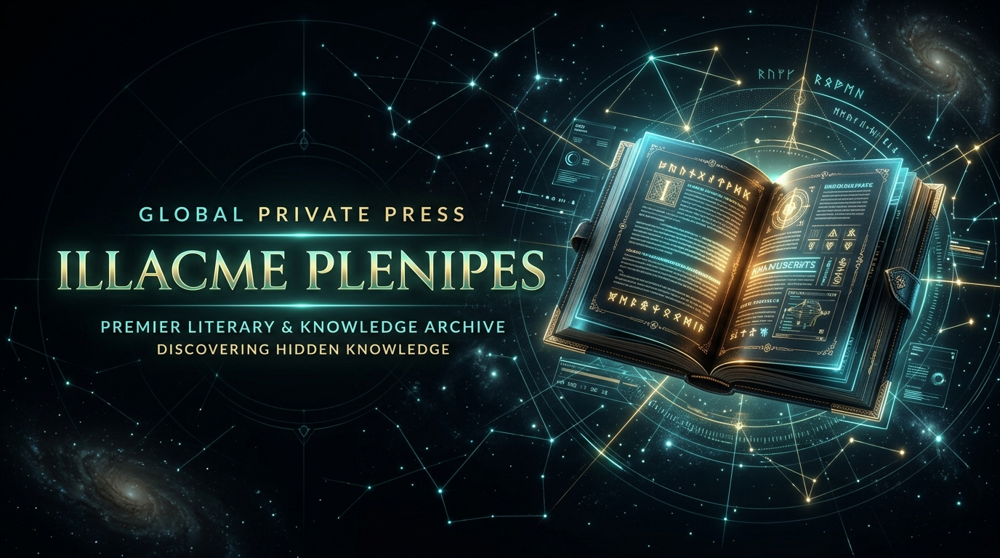
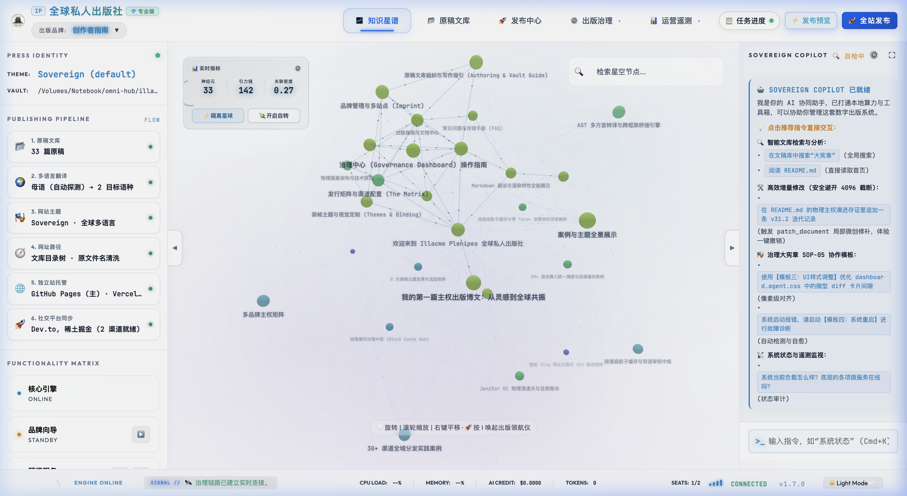
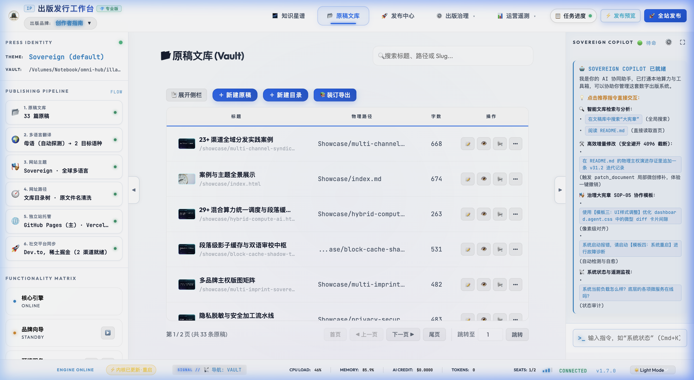
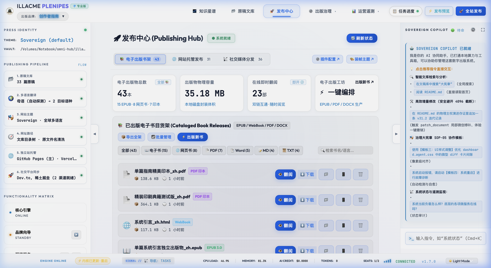
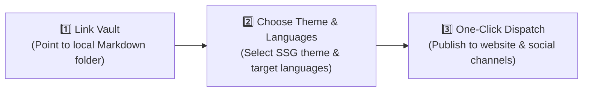

# 🏛️ Illacme Plenipes: Global Private Press

> **Industrial-grade digital publishing & distribution workbench built for sovereign creators.**  
> Native Markdown Vault ➔ Polyglot AI Translation ➔ Professional Typesetting ➔ Static Web Hosting & 30+ Social Media Syndication.



[](https://github.com/Illacme/illacme-plenipes)
[](https://www.python.org/)
[](https://polyformproject.org/licenses/noncommercial/1.0.0/)

[🇨🇳 简体中文](./README.zh-CN.md) | [🇬🇧 English](./README.md) | [📖 Cookbooks](./docs/cookbook/) | [📚 User Manual](./docs/manual/)

---

### 🖥️ Meet The Sovereign Publishing Workbench

> **“Say goodbye to scattered terminal scripts and fragile pipelines. Digital publishing is now an inspiring visual symphony.”**

Illacme Plenipes transforms the industrial publishing capabilities typically reserved for premier media enterprises into an elegant, dark-mode glassmorphic **desktop workbench**.

#### 🌌 1. 3D Galaxy Knowledge Graph & Pipeline Director
How does a single manuscript radiate across the globe? The workbench opens with an interactive **3D force-directed knowledge graph** and an end-to-end **six-stage publishing pipeline**.



* **3D Force-Directed Constellation**: Real-time gravitational link calculations; click any planetary node to drill down into the underlying manuscript.
* **Live Six-Stage Pipeline**: `Vault Origin ➔ Polyglot AI Translation ➔ Web Theme ➔ URL Routing ➔ Web Hosting ➔ Social Syndication` with real-time status pulses.
* **Persistent Sovereign Copilot**: Dedicated AI coordinator with streaming Chain-of-Thought (CoT) reasoning, vault semantic search, and autonomous patch generation.

---

#### 📂 2. Manuscript Vault & Direct Publishing Drawer
Designed for pure, distraction-free writing and editorial control.



* **100% Local Vault Integrity**: Connect directly to your local Obsidian or Markdown folder with zero remote cloud leakage.
* **Lifecycle Audit**: Word counts, slug path cleanups, and multi-language alignment matrix at a glance.
* **Single-Doc Publishing Drawer**: Deploy or syndicate individual documents with precise incremental builds.

---

#### 🚀 3. Omni-Channel Dispatch Hub & Cataloged Bookshelf
Deliver your thoughts to worldwide audiences in every prestigious format.



* **📚 Cataloged Book Releases**: Generate side-by-side polyglot **DOCX (with OMML math equations)**, **print-ready PDF books**, **EPUB 3.0**, and **hyperlinked WebBooks** with built-in instant reading and export.
* **🌐 Static Web Hosting Matrix**: One-click deployment across 10 static platforms (GitHub Pages, Vercel, Netlify, Cloudflare Pages, etc.) with **automatic live URL backfilling**.
* **🛰️ 30+ Social Media Syndication**: Instant push to WeChat Official Account, Zhihu, Juejin, Dev.to, Hashnode, Medium, Ghost, and Substack with asset localization and anti-hotlinking protection.

---

### 💡 Why Illacme Plenipes?

As an independent writer, overseas team, or technical blogger, writing is pure, but distribution is tedious:
1. **Repetitive Formatting**: Copy-pasting across WeChat Official Account, Zhihu, Dev.to, Medium, and wrestling with hotlinking images.
2. **Polyglot Synchronization**: Translating articles manually leads to drift, and keeping multiple language versions updated is daunting.
3. **Complex Web Hosting**: Setting up and deploying full-fledged multi-language static websites (Docusaurus, Starlight, VitePress) requires heavy Node.js and CI/CD maintenance.

**Illacme Plenipes** automates the entire distribution lifecycle:
* 🌍 **Local Origin, Global Resonance**: Maintain a single local Markdown vault (fully compatible with Obsidian / Logseq). AI handles context-aware sentence slicing, translation, and self-healing review.
* 🌐 **Static Web Hosting Matrix**: Deploy across 10 static hosting drivers (GitHub Pages, Vercel, Netlify, Cloudflare Pages, SFTP, etc.) with primary & backup mirror routing.
* 🛰️ **30+ Social Media Syndication**: Push one-click to WeChat Official Account, Zhihu, Juejin, Dev.to, Hashnode, Medium, Ghost, Substack, etc., with automatic image asset re-hosting.
* 📚 **Press-Grade Typesetting**: Assemble side-by-side polyglot **DOCX (with OMML math), print-ready PDF, and EPUB** books with deep TOCs.
* 🛡️ **Absolute Sovereign Integrity**: Vault stays 100% local. Physical imprint data isolation. Support for local offline models (Ollama, LM Studio).

---

### 🚀 Quick Start (Zero-Configuration)

#### 📦 1. Official Desktop Releases (Recommended)

Download the ready-to-run compiled desktop clients from **[GitHub Releases](https://github.com/Illacme/illacme-plenipes/releases/latest)**:

| Operating System | Package Format | Binary Asset | Recommended Scenario |
| :--- | :--- | :--- | :--- |
| 🍎 **macOS (Apple Silicon)** | **Native DMG Image** | `Illacme-Plenipes-macOS-AppleSilicon-arm64.dmg` | **Recommended**: Mount and drag into Applications |
| 🍎 macOS (Apple Silicon) | Portable ZIP | `Illacme-Plenipes-macOS-AppleSilicon-arm64.zip` | Extract and run directly |
| 🪟 **Windows (x64)** | **Setup Installer (.exe)** | `Illacme-Plenipes-Windows-x64-Setup.exe` | **Recommended**: Standard installer with desktop shortcuts |
| 🪟 Windows (x64) | Portable ZIP | `Illacme-Plenipes-Windows-x64.zip` | Standalone portable bundle, no installation needed |
| 🐧 **Linux (x64)** | Native Tarball | `Illacme-Plenipes-Linux-x64.tar.gz` | Run on Linux desktop and server distributions |

> [!IMPORTANT]
> ### 🛡️ First-Run Security Trust Guide (Eliminating Onboarding Friction)
> As an independent open-source publication client without corporate EV code signing certificates, your OS may trigger security warnings on initial launch. Follow these simple steps to unlock:
>
> * **🍎 macOS prompts "App is damaged and can't be opened" or "Unverified developer"**:
>   * **Option A (One-line Terminal fix, recommended)**: Open Terminal and run the command to strip the quarantine attribute:
>     ```bash
>     xattr -cr /Applications/Illacme-Plenipes.app
>     ```
>   * **Option B (GUI bypass without Terminal)**: In Finder -> Applications, **hold the `Control` key and right-click** `Illacme-Plenipes.app`, click **Open** in the context menu, then click **Open** again in the security dialogue.
>
> * **🪟 Windows Defender SmartScreen blue dialog ("Windows protected your PC")**:
>   * Click the **"More info"** link in the dialog text;
>   * Click the **"Run anyway"** button that appears in the lower-right corner.

---

#### 💻 2. Zero-Config Launchers (Source Mode)

If you have cloned the repository, use our automatic cross-platform double-click launchers:

*   **🍎 macOS**: Double-click **`start.command`** in Finder (zero CLI needed; browser pops up automatically).
*   **🪟 Windows**: Double-click **`start.bat`** (or run `.\start.ps1` in PowerShell).
*   **🐧 Linux / Server**: Run `./start.sh`.
*   **🐳 Docker Compose**: Run `docker compose up -d`.

> 💡 **Dashboard Access**: Workbench UI runs at `http://127.0.0.1:43212`.

> ⌨️ **Keyboard Shortcuts**:
> * `Cmd+P` (`Ctrl+P` on Windows/Linux): Open Command Palette (Feature navigation & In-App Cookbooks);
> * `Cmd+K` (`Ctrl+K` on Windows/Linux) or `]`: Summon Sovereign Copilot AI assistant (focus instruction prompt);
> * `I` (or click top-left Logo): Toggle Publishing Navigator launchpad;
> * `[`: Toggle left navigation sidebar.

<details>
<summary><b>📝 Click to expand: Minimal Markdown Sample (Obsidian Compatible)</b></summary>

```markdown
---
title: "My First Sovereign Publication"
description: "How to syndicate and publish globally using Illacme Plenipes."
tags: ["Publishing", "Markdown", "OpenSource"]
categories: ["Tech"]
draft: false
cover: "assets/covers/hero.png" # Optional, auto-generated by Design Studio
---

# Welcome to Sovereign Publishing

You can freely use standard Markdown, LaTeX math, and Obsidian wiki-links:
* Internal link: See [[architecture-overview]].
* Block math equation:
$$E = mc^2$$

The engine automatically sanitizes and renders native blocks across all destination targets!
```
</details>

---

### 🎯 3-Step Creator Journey


```mermaid
graph LR
    A["1️⃣ Link Vault<br/>(Point to local Markdown folder)"] --> B["2️⃣ Choose Theme & Languages<br/>(Select SSG theme & target languages)"]
    B --> C["3️⃣ One-Click Dispatch<br/>(Publish to website & social channels)"]
```

1. **Step 1: Link Manuscript Vault**: Configure `vault_root` in Governance Settings. The engine parses the hierarchy tree, links, and draft states.
2. **Step 2: Theme & Compute Setup**: Pick a mother theme (Docusaurus, Starlight, VitePress, etc.) and AI provider (OpenAI, Gemini, DeepSeek, Claude, or local Ollama).
3. **Step 3: Multi-Channel Egress**: Click deploy inside the document drawer to trigger static hosting push and social syndication with real-time logs.

---

### 🧩 Core Feature Matrix

| Hub Module | Capabilities | Documentation |
| :--- | :--- | :--- |
| **🌌 Galaxy Overview** | 3D force-directed knowledge graph, UnrealBloom pass, multi-dimensional filters, HUD Director | [Galaxy Guide](./docs/manual/01_overview_galaxy.md) |
| **📂 Content Vault** | Markdown / WYSIWYG dual-mode editor, Frontmatter parsing, asset localization | [Vault Guide](./docs/manual/02_vault_management.md) |
| **📖 Bindery Bookshelf** | Polyglot parallel typesetting, DOCX / PDF / EPUB export, dynamic QR diagnostic | [Bindery Guide](./docs/manual/03_bindery_publishing.md) |
| **🚀 Dispatch Hub** | Multi-channel publishing hall, SQLite deploy ledger, single-doc & site pushes, live URLs | [Dispatch Guide](./docs/manual/04_dispatch_and_hosting.md) |
| **⚙️ Governance** | Physical imprint isolation, 6 SSG mother themes, block translation rules, Review Workbench | [Governance Guide](./docs/manual/05_governance_and_review.md) |
| **🧠 Compute Engine** | 25+ AI providers, auto-failover, Sovereign Copilot autonomous coordinator with HITL review | [Compute Guide](./docs/manual/06_compute_and_copilot.md) |
| **🎨 Design Studio** | AI image generation (DALL-E/Imagen/Midjourney), local OG card renderer, cover batch rotation | [Design Guide](./docs/manual/07_design_studio.md) |
| **🧩 Plugins Hub** | 10 hosting drivers + 20+ social channels + 14 image hosts, central credential sensing (SSOT) | [Plugins Guide](./docs/manual/08_plugins_ecosystem.md) |

---

### 💻 Developer CLI Mode

```bash
# 1. Clone & Setup
git clone https://github.com/Illacme/illacme-plenipes.git
cd illacme-plenipes
pip install -r requirements.txt

# 2. Interactive Console
python3 plenipes.py 

# 3. Full Pipeline Sync
python3 plenipes.py --sync --force

# 4. File Watcher Daemon
python3 plenipes.py --watch
```

---

### 📜 Licensing & Governance

*   **Open Source Noncommercial**: Licensed under [PolyForm Noncommercial 1.0.0](https://polyformproject.org/licenses/noncommercial/1.0.0/) for personal and research use.
*   **Commercial Licensing**: Commercial usage, corporate distribution, or multi-tenant deployment requires a written license. See [COMMERCIAL_LICENSE.md](./COMMERCIAL_LICENSE.md) and [EULA](./docs/legal/EULA.md) (Contact: `wqbyc@msn.com`).
*   **Data Sovereignty**: Zero remote data leakage. See [Data Sovereignty Agreement](./docs/legal/DATA_SOVEREIGNTY.md).
*   **Disclaimers**: See [Third-Party Disclaimers](./docs/legal/THIRD_PARTY_DISCLAIMER.md) and [Notices](./docs/legal/THIRD_PARTY_NOTICES.md).

---

*Powered by **Illacme Plenipes** | Sovereign Publishing for the Independent Mind.*