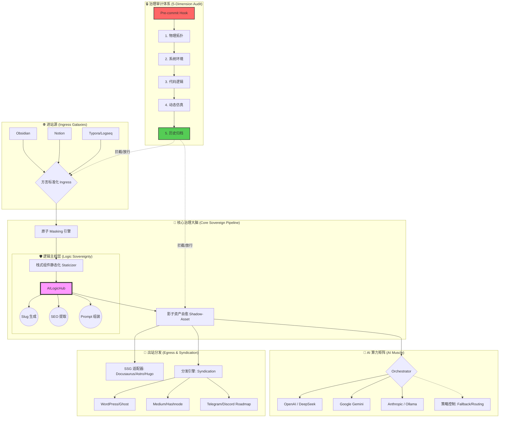

# 🏛️ Illacme-plenipes v5.4.1 架构全景图 (Architecture Overview)

## 1. 核心设计哲学
Illacme-plenipes 采用 **“治理优先 (Governance-First)”** 的设计理念。项目不仅关注功能的实现，更通过物理层面的约束确保架构在长期自动化演化中不发生退化。

## 2. 架构拓扑图

## 3. 核心星系说明

### 🏗️ 物理拓扑维度 (Topology)
负责扫描全量包结构与静态导入路径。确保 `core/` 下的每一个模块在物理上是连通的，杜绝死循环导入与虚假路径。

### 🧩 逻辑主权层 (Logic Sovereignty)
采用“大脑与肢体”分离设计。核心业务逻辑（Slug/SEO/Prompt）被锁死在基类，适配器仅负责原子协议通信。严禁子类“越权篡改”核心逻辑。

### 🩹 影子资产自愈 (Shadow-Asset)
创新的缓存机制。在前端物理产物丢失或 AI API 故障时，引擎能瞬间从影子资产中恢复，确保发布流程的极致稳定性。

### 🔒 5-Dimension 治理系统 (Governance)
作为系统的“免疫系统”，通过 60/60 项工业级审计指标，在 `Pre-commit` 阶段物理拦截所有非标变更，确保代码质量不随时间退化。

---
🛡️ *本文档受 v5.4.1 治理协议保护，任何架构变更必须同步更新此图。*
