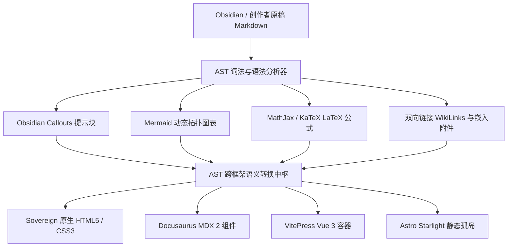

# 🌳 AST 多方言转译与跨框架桥接引擎

> [!TIP]
> **原稿零污染，抹平所有静态框架语法断层**：Obsidian、Docusaurus、VitePress、Astro 与 Hugo 各自拥有互不兼容的 Markdown 方言扩展（如 Callouts 语法、MDX 组件、Mermaid 图表与数学公式）。Illacme Plenipes 内置工业级 AST 抽象语法树转译流水线，在内存中动态抹平语法断层，原稿文库无需修改任何一行代码即可在 8 大框架中完美呈现！

---

## ⚡ AST 方言转译核心指标

<div class="stats-matrix" style="display: grid; grid-template-columns: repeat(auto-fit, minmax(220px, 1fr)); gap: 1.5rem; margin: 2rem 0;">
    <div class="stat-card" style="padding: 1.25rem 1.5rem; background: var(--card-bg); border-radius: 16px; border: 1px solid var(--border-color);">
        <div style="font-size: 0.8rem; color: var(--text-secondary); margin-bottom: 4px;">🧩 方言支持度</div>
        <div style="font-size: 1.15rem; font-weight: 700; color: #00f2fe;">Obsidian · GFM · MDX · CommonMark</div>
    </div>
    <div class="stat-card" style="padding: 1.25rem 1.5rem; background: var(--card-bg); border-radius: 16px; border: 1px solid var(--border-color);">
        <div style="font-size: 0.8rem; color: var(--text-secondary); margin-bottom: 4px;">⚡ 内存解析速度</div>
        <div style="font-size: 1.15rem; font-weight: 700; color: #00ff88;">< 2 ms / 篇 (纯 Python 极速管道)</div>
    </div>
    <div class="stat-card" style="padding: 1.25rem 1.5rem; background: var(--card-bg); border-radius: 16px; border: 1px solid var(--border-color);">
        <div style="font-size: 0.8rem; color: var(--text-secondary); margin-bottom: 4px;">🛡️ 原稿保护度</div>
        <div style="font-size: 1.15rem; font-weight: 700; color: #ffb300;">100% 只读 · 0 物理写入污染</div>
    </div>
    <div class="stat-card" style="padding: 1.25rem 1.5rem; background: var(--card-bg); border-radius: 16px; border: 1px solid var(--border-color);">
        <div style="font-size: 0.8rem; color: var(--text-secondary); margin-bottom: 4px;">📊 跨框架适配</div>
        <div style="font-size: 1.15rem; font-weight: 700; color: var(--accent-color);">8 大装帧主题 100% 视觉对齐</div>
    </div>
</div>

---

## 🛠️ AST 语法桥接流水线机制



### 1. 💡 Obsidian Callouts 提示块智能抹平
* 自动识别 `> [!NOTE]`、`> [!TIP]`、`> [!WARNING]`、`> [!DANGER]` 等 12 种 Obsidian 原生 Callouts 语法；
* 针对原生主题输出语义化毛玻璃容器，针对 Docusaurus / VitePress 输出原生 Admonitions 容器，保持在所有主题中视觉绝对一致。

### 2. 📊 Mermaid 拓扑图与 LaTeX 复杂公式无损编译
* 拦截文稿中的 ````mermaid` 代码块与 `$$ E=mc^2 $$` 数学公式，自动处理转义字符与容器包裹；
* 无论是现代 SPA 前端还是纯静态 HTML，均能实现图表的高性能即时渲染与缩放。

### 3. 🔗 绝对防 404 的双链链路转译
* 将 `[[My Document|自定义别名]]` 在内存中精确映射至当前目标主题的具体路由规则（如 `showcase/my-document.html`）；
* 深度支持锚点跳转（如 `[[My Doc#Chapter 2]]`）与多语言自动频道隔离，彻底告别 404 页面。
