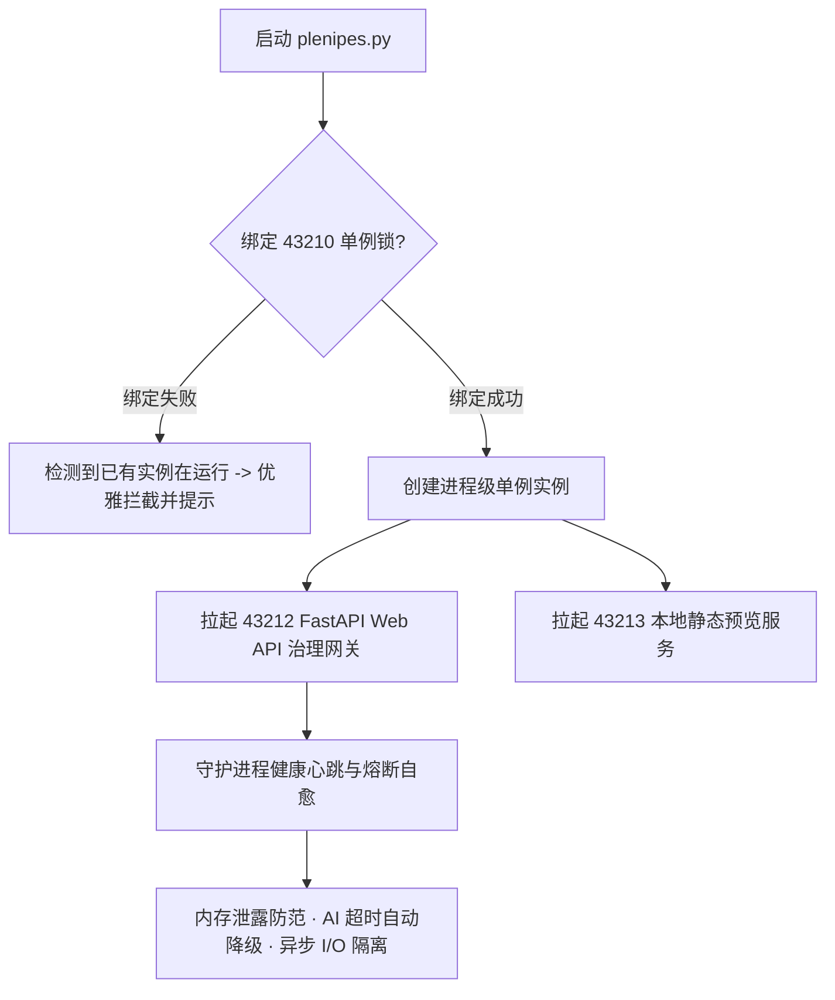

# 🔒 4 端口物理单例锁与高可用容错自愈网关

> [!TIP]
> **物理单例占位，进程永不冲突，故障秒级自愈**：在后台长期运行的守护系统中，最危险的隐患是多个进程重复拉起导致数据库锁死、文件账本损坏或端口冲突。Illacme Plenipes 设计了严格的 4 端口物理职责划分与单例锁（Singleton Lock）守门体系。

---

## ⚡ 4 端口物理规划与架构矩阵

    

        
🔒 43210 单例锁端口

        
进程唯一性占位锁

    

    

        
🔌 43212 Web API 网关

        
FastAPI 控制中枢 · 毫秒响应

    

    

        
🧙 43211 可视化向导

        
安装引导与配置向导服务

    

    

        
🌐 43213 本地预览服务

        
零跨域静态站即时热呈现

    

---

## 🛠️ 单例锁机制与自愈架构

### 1. 🔒 43210 物理单例锁（Singleton Process Lock）
* 系统启动时首先尝试在 `127.0.0.1:43210` 创建独占式 Socket 绑定；
* 若端口已被占用，系统立即拦截二次启动，并给出清晰提示，**物理根绝了后台多进程竞争导致的指纹账本破坏与 SQLite 文件写入死锁**。

### 2. 🔌 43212 FastAPI 治理网关与物理隔离
* 负责承载全站治理中心（Dashboard）的所有 RESTful API 与实时 WebSocket 广播；
* 与本地预览服务（`43213`）严格物理隔离，即便静态站点在编译或刷新，也不会阻塞治理中心的操作与遥测指标采集。

### 3. 🛡️ 异常熔断与健康自愈（Resilience & Fault-Tolerance）
* **AI 算力超时熔断**：当云端大模型接口或本地 Ollama 出现网络 hang 住时，自愈网关自动触发超时保护并降级至段落影子缓存或备用算力管道；
* **非交互子进程保护**：所有后台外部 CLI 调用均强制附加 `--yes` / `-y` 与非交互标志，彻底避免因等待用户输入而导致后台挂起。
