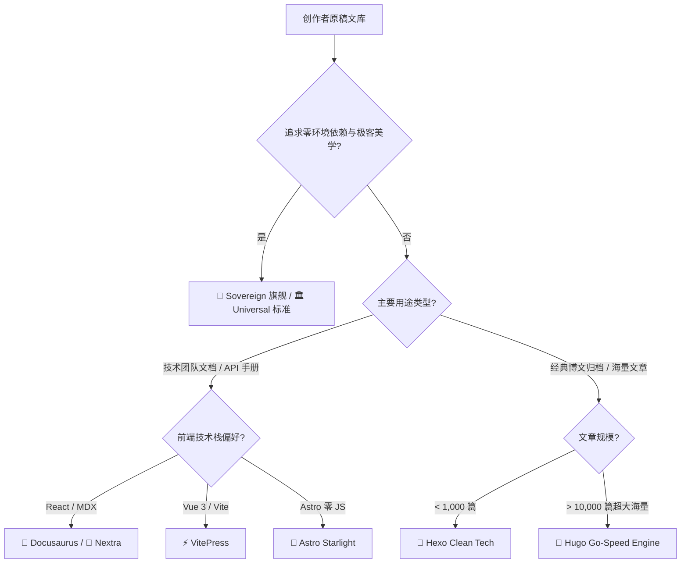

# 🎭 8 大装帧主题全景与选型矩阵

> [!TIP]
> **一套原稿文库，任意装帧自由穿梭**：在 Illacme Plenipes 中，创作者的物理原稿享有绝对的数据主权。同一套 Markdown 文库无需修改任何源代码，即可一键穿上 8 套完全不同的现代视觉外衣与静态生成引擎。

---

## 📊 8 大装帧主题横向选型矩阵

<table style="width: 100%; border-collapse: collapse; text-align: left; font-size: 0.9rem;">
  <thead>
    <tr style="background: var(--bg-elevated); border-bottom: 2px solid var(--border-color);">
      <th style="padding: 12px 14px;">装帧主题</th>
      <th style="padding: 12px 14px;">底层技术栈</th>
      <th style="padding: 12px 14px;">首屏体积</th>
      <th style="padding: 12px 14px;">构建依赖</th>
      <th style="padding: 12px 14px;">核心视觉风格</th>
      <th style="padding: 12px 14px;">最佳适用场景</th>
    </tr>
  </thead>
  <tbody>
    <tr style="border-bottom: 1px solid var(--border-color);">
      <td style="padding: 12px 14px; font-weight: 700; color: #00f2fe;">👑 Sovereign Neon Glass</td>
      <td style="padding: 12px 14px;">原生 HTML5 / CSS3 / Vanilla JS</td>
      <td style="padding: 12px 14px; color: #00ff88; font-weight: 600;">< 50 KB</td>
      <td style="padding: 12px 14px; color: #00ff88;">零外部依赖 (直出)</td>
      <td style="padding: 12px 14px;">暗黑霓虹 · 赛博毛玻璃 · 微光进度条</td>
      <td style="padding: 12px 14px;">极客个人主权知识库 · 私人出版物</td>
    </tr>
    <tr style="border-bottom: 1px solid var(--border-color);">
      <td style="padding: 12px 14px; font-weight: 700; color: #58a6ff;">🏛️ Universal Standard</td>
      <td style="padding: 12px 14px;">原生 HTML5 / 语义化 CSS</td>
      <td style="padding: 12px 14px; color: #00ff88; font-weight: 600;">< 30 KB</td>
      <td style="padding: 12px 14px; color: #00ff88;">零外部依赖 (直出)</td>
      <td style="padding: 12px 14px;">极简通用 · 清爽大方 · 明暗无缝切换</td>
      <td style="padding: 12px 14px;">企业白皮书 · 经典双栏文档 · 标准博文</td>
    </tr>
    <tr style="border-bottom: 1px solid var(--border-color);">
      <td style="padding: 12px 14px; font-weight: 700; color: #3578e5;">🦖 Docusaurus Documentation</td>
      <td style="padding: 12px 14px;">React 18 / MDX 2</td>
      <td style="padding: 12px 14px;">~150 KB</td>
      <td style="padding: 12px 14px;">Node.js / npm</td>
      <td style="padding: 12px 14px;">Meta 工业级标准文档 · 强大侧边栏树</td>
      <td style="padding: 12px 14px;">开源项目官方网站 · 复杂多版本技术文档</td>
    </tr>
    <tr style="border-bottom: 1px solid var(--border-color);">
      <td style="padding: 12px 14px; font-weight: 700; color: #42b883;">⚡ VitePress Ultra-Fast</td>
      <td style="padding: 12px 14px;">Vue 3 / Vite 5</td>
      <td style="padding: 12px 14px;">~80 KB</td>
      <td style="padding: 12px 14px;">Node.js / npm</td>
      <td style="padding: 12px 14px;">极速轻量 · 优雅细腻 · 毫秒级热重载</td>
      <td style="padding: 12px 14px;">现代技术团队开发手册 · 前端组件库文档</td>
    </tr>
    <tr style="border-bottom: 1px solid var(--border-color);">
      <td style="padding: 12px 14px; font-weight: 700; color: #bc52ee;">🌟 Astro Starlight Garden</td>
      <td style="padding: 12px 14px;">Astro 4 / TypeScript</td>
      <td style="padding: 12px 14px; color: #00ff88; font-weight: 600;">< 40 KB</td>
      <td style="padding: 12px 14px;">Node.js / npm</td>
      <td style="padding: 12px 14px;">零 JS 孤岛 · 现代排版 · 优雅暗黑渐变</td>
      <td style="padding: 12px 14px;">数字花园 · 深度长文索引 · 高性能文档</td>
    </tr>
    <tr style="border-bottom: 1px solid var(--border-color);">
      <td style="padding: 12px 14px; font-weight: 700; color: #ffffff;">📖 Nextra Documentation</td>
      <td style="padding: 12px 14px;">Next.js 14 / React 18</td>
      <td style="padding: 12px 14px;">~120 KB</td>
      <td style="padding: 12px 14px;">Node.js / npm</td>
      <td style="padding: 12px 14px;">Vercel 设计哲学 · SPA 单页平滑路由</td>
      <td style="padding: 12px 14px;">SaaS 产品文档 · 现代开发者中心</td>
    </tr>
    <tr style="border-bottom: 1px solid var(--border-color);">
      <td style="padding: 12px 14px; font-weight: 700; color: #0e83cd;">🎨 Hexo Clean Tech</td>
      <td style="padding: 12px 14px;">Node.js / EJS</td>
      <td style="padding: 12px 14px;">~60 KB</td>
      <td style="padding: 12px 14px;">Node.js / hexo-cli</td>
      <td style="padding: 12px 14px;">经典静态博客 · 年鉴式时间轴归档</td>
      <td style="padding: 12px 14px;">经典博文归档 · 极速万篇静态博客生成</td>
    </tr>
    <tr>
      <td style="padding: 12px 14px; font-weight: 700; color: #ff4088;">🐹 Hugo Go-Speed Engine</td>
      <td style="padding: 12px 14px;">Go 语言二进制</td>
      <td style="padding: 12px 14px; color: #00ff88; font-weight: 600;">< 45 KB</td>
      <td style="padding: 12px 14px;">Hugo 二进制 (无 npm)</td>
      <td style="padding: 12px 14px;">超高速编译 · 极简结构 · 毫秒级生成</td>
      <td style="padding: 12px 14px;">超大型海量文库 (10,000+ 篇) · 极速 CI/CD</td>
    </tr>
  </tbody>
</table>

---

## 🔍 8 大装帧深度解析与视觉特色

### 1. 👑 Sovereign Neon Glass（主权原生旗舰）
* **零依赖直出**：纯 Python 极速转换，无需安装 Node.js、npm 或任何外部运行时；
* **暗黑赛博美学**：专属霓虹色系（`#00f2fe`、`#4facfe`）、微光毛玻璃浮层、阅读微光进度条与动态 TOC 目录跟随；
* **离线全局搜索**：内置轻量纯客户端索引与 Obsidian 双向链接原生解析。

### 2. 🏛️ Universal Standard（通用极简标准）
* **极致性能**：整站首屏 CSS/JS 体积小于 30KB，秒开体验；
* **多视图博客**：原生支持时间轴（Timeline）、网格卡片（Grid）与紧凑列表（Compact）三视图自由切换；
* **企业级排版**：中英文排版规范自动对齐，完美支持数学公式与 Mermaid 拓扑图。

### 3. 🦖 Docusaurus Documentation（Meta 工业级）
* **主流开源标准**：Meta 开源的世界级文档引擎，支持完整的 MDX 动态交互组件；
* **深层版本管理**：原生支持多版本归档、国际化多语言与多层级嵌套侧边栏。

### 4. ⚡ VitePress Ultra-Fast（极速技术文档）
* **Vue 3 生态旗舰**：尤雨溪团队打造的现代文档引擎，基于 Vite 极速构建；
* **毫秒级响应**：静态 HTML 预渲染与客户端 SPA 结合，翻页体验丝滑无比。

### 5. 🌟 Astro Starlight Garden（现代数字花园）
* **Islands 孤岛架构**：默认 0 JavaScript 运行时消耗，达到卓越的 Lighthouse 满分表现；
* **优雅渐变**：精心调校的暗黑模式渐变色调与深层全文索引支持。

### 6. 📖 Nextra Documentation（现代极简文档）
* **Next.js 驱动**：完美契合 Vercel 设计风格，SPA 无缝单页路由过渡；
* **FlexSearch 搜索**：毫秒级响应的客户端分词即时检索。

### 7. 🎨 Hexo Clean Tech（经典静态博客）
* **成熟社区生态**：全球最流行的静态博客之一，拥有海量插件与小工具；
* **分类年鉴体系**：针对长年写作积累的深度标签云、分类树与归档时间轴。

### 8. 🐹 Hugo Go-Speed Engine（超快 Go 构建）
* **单二进制性能怪兽**：Go 语言编写，编译上万篇长文仅需数毫秒；
* **无依赖部署**：极其适合资源受限的边缘服务器或自动化 CI/CD 流水线。

---

## 🎯 场景选型决策树

---

## 🔄 治理中心一键热切换

在 Illacme Plenipes 治理中心（`http://127.0.0.1:43212/dashboard/#/themes`）的 **「🎭 装帧主题」** 面板中，只需点击对应主题卡片上的 **「🎯 激活并应用」**，系统即可在 0.5 秒内自动切换编译管线与本地实时预览服务（`43213`），助您轻松探索最适合当前出版作品的终极装帧形态！
