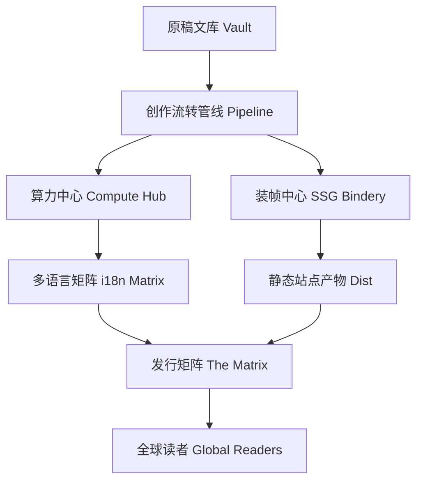

# 🌐 关于 Illacme Press 出版团队

**Illacme Press** 致力于打破中心化内容平台的数字壁垒，将**创作自由**与**数据物理主权**彻底交还给每一位独立创作者、学者与写作团队。

---

## 🌟 我们的出版哲学

### 1. 物理主权优先 (Physical Sovereignty First)
- 您的原稿（Markdown）永久停留在您的本地磁盘上，系统采用**只读探测与增量同步**。
- 绝不锁定特定格式，完美兼容标准 Obsidian、Logseq、Notion 导出及 CommonMark。

### 2. 算力民主化 (Democratic Compute)
- 支持本地开源小模型（Ollama / LMStudio）与商业大模型（OpenAI / DeepSeek / Gemini / 百度千帆等 29+ 适配器）无缝调度。
- 通过段落级增量影子缓存（BlockShadowCache），将翻译算力成本降低 90% 以上。

### 3. 一处起草，全球共振 (Write Once, Resonate Globally)
- 一篇母语原稿，自动润色、翻译成多国语言、生成 SEO 结构化数据，同步推送至全球全渠道矩阵。

---

## 🛠️ 架构分层

---

## 🤝 加入与贡献

Illacme Plenipes 是一个开放演进的出版生态。

- **GitHub 仓库**：[https://github.com/Illacme/illacme-plenipes](https://github.com/Illacme/illacme-plenipes)
- **协议**：CC BY-NC 4.0

感谢您选择 **Illacme Plenipes** 开启您的全球私人出版之旅！
